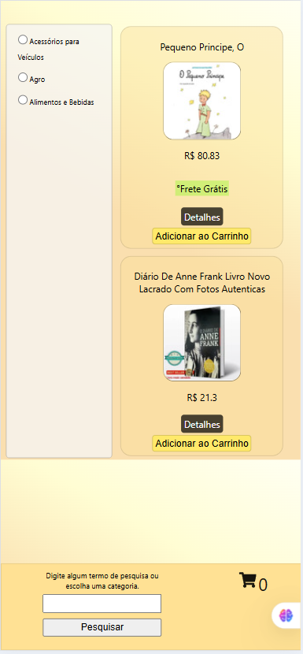
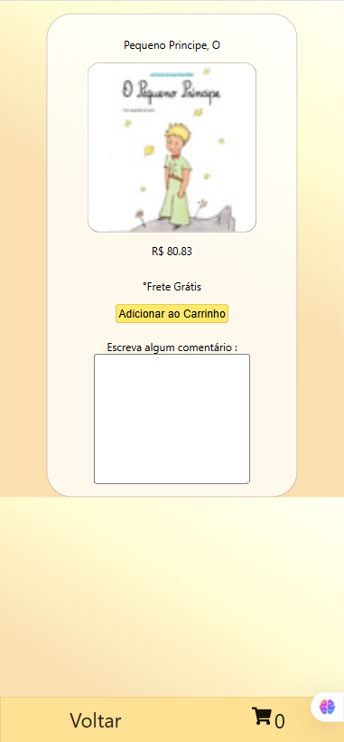
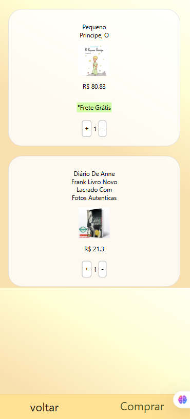
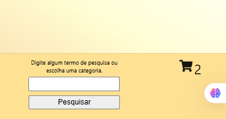

# 🛍️ Online Store Project

Projeto de e-commerce desenvolvido em React como parte de um trabalho em grupo, com foco em consumo de API externa e uso de mock local como fallback para garantir funcionamento da aplicação.

---

## 🚀 Sobre o projeto

Este projeto simula uma loja online com listagem de produtos, filtragem por categorias e busca por nome.

A aplicação consome a API do Mercado Livre e possui um sistema de fallback com dados mockados locais, garantindo a continuidade da experiência mesmo quando a API não retorna dados corretamente.

---

## 👥 Desenvolvimento em grupo

Este projeto foi desenvolvido em equipe, com divisão de tarefas entre:

- Estrutura de componentes React
- Integração com API externa
- Implementação de filtros e busca
- Tratamento de fallback com mock
- Estilização e interface

---

## 🧠 Funcionalidades

- Listagem de produtos
- Filtro por categorias
- Busca por nome
- Fallback automático para mock de dados
- Interface responsiva
- Gerenciamento de estado com React

---

## 🔁 Lógica da aplicação

A aplicação funciona com duas fontes de dados:

### API externa
Busca produtos e categorias dinamicamente.

### Mock local
Usado como fallback quando a API não retorna dados válidos.

---

## 🛠️ Tecnologias

- React
- JavaScript (ES6+)
- Fetch API
- CSS
- Mock de dados local

---

## ⚠️ Status do projeto

Projeto em evolução, com melhorias planejadas:

- Ajuste de consistência entre API e mock
- Refinamento dos filtros de categoria
- Melhor tratamento de estados vazios
- Melhorias de UI/UX
- Refatoração de fluxo de dados

---

## 📸 Preview

  
  
  

  

---

## 📚 Aprendizados

- Consumo de APIs externas
- Tratamento de fallback com mock
- Manipulação de estado em React
- Filtragem dinâmica de dados
- Debug de fluxo de dados em aplicações reais

---

## Como rodar o codigo na maquina?

Assim que o projeto estiver em sua maquina você deve :
-  instalar dependencias : npm install
( aviso:  instalaçoes e versoes trabalhadas em uma máquina linux ubunto/mint)

-  rodar o projeto / abrir no browser: npm start

#### Disponivel no Github pages , link na descriçao do repositório (About )

---

## 👩‍💻 Autora

Projeto desenvolvido em colaboração em grupo.
Contribuição individual em lógica de filtros, responsividade , integração de dados e tratamento de fallback...

